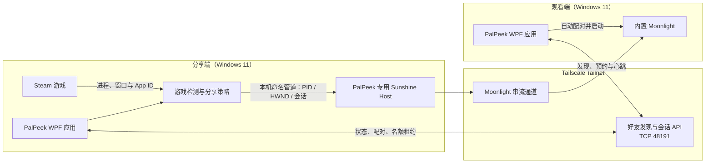

# PalPeek

PalPeek 是一款面向小型 Tailscale 好友网络的 Steam 游戏观战工具。玩家启动 Steam 游戏后，PalPeek 会自动识别游戏及其窗口，并允许同一 Tailnet 中的好友通过内置 Moonlight 观看。

> PalPeek 只提供观战，不提供远程控制。当前版本为 **0.3.1**，仅支持 **Windows 11 x64**。

## 目录

- [系统架构](#系统架构)
- [功能说明](#功能说明)
- [如何使用](#如何使用)
- [安全保证说明](#安全保证说明)
- [当前限制](#当前限制)
- [开发与构建](#开发与构建)

## 系统架构

PalPeek 采用“桌面应用 + Tailnet 内点对点 API + 专用串流组件”的架构。每台参与观战的电脑都安装 PalPeek 和 Tailscale，同一个 PalPeek 实例既可以分享游戏，也可以观看好友的游戏。



### 主要组件

| 组件 | 职责 |
| --- | --- |
| `PalPeek.App` | WPF 用户界面、托盘、设置、好友发现、观战流程和进程生命周期管理 |
| `PalPeek.Core` | Steam 游戏目录与进程识别、窗口选择、Tailscale 节点解析、分享策略、协议模型和观看名额管理 |
| PalPeek 专用 Sunshine | 只捕获指定游戏窗口与游戏进程树音频，负责 H.264 串流 |
| 内置 Moonlight | 在观看端完成自动配对并播放好友的游戏画面 |
| Tailscale | 提供好友设备发现、Tailnet 地址和加密的点对点网络 |

### 工作流程

1. PalPeek 读取 Steam 主库和附加库，持续检测正在运行的 Steam 游戏。
2. 游戏窗口稳定后，PalPeek 将经过校验的 PID、HWND 和会话 ID 通过本机命名管道交给专用 Sunshine。
3. PalPeek 只在本机的 Tailscale 地址上监听好友 API，并定期探测同一 Tailnet 中的在线设备。
4. 观看者点击好友卡片后，客户端先申请观看名额，再自动完成 Moonlight 配对并启动播放器。
5. 播放期间客户端持续续租；播放器退出、分享停止或租约超时后，名额自动释放。

## 功能说明

### 自动发现与分享

- 自动读取 Steam 主库及附加库中的已安装游戏。
- 自动识别正在运行的 Steam 游戏、进程树和主要可见窗口。
- 游戏窗口稳定后自动开始分享，无需手动选择屏幕。
- 只捕获指定游戏窗口，不捕获整个桌面，也不会回退到桌面捕获。
- 只采集游戏进程树音频，不采集全系统声音，不影响玩家本地播放。
- 游戏结束、窗口失效或捕获组件异常时自动停止对应会话。
- 分享期间托盘图标显示状态圆点，并在分享开始和结束时发送 Windows 通知。

### 好友观战

- 通过 Tailscale 自动发现同一 Tailnet 中在线的 PalPeek 好友。
- 显示好友昵称、正在分享的游戏、画质、状态和当前观看人数。
- 点击好友卡片即可申请名额、自动配对并启动内置 Moonlight。
- 播放期间自动续租，关闭 Moonlight 后自动释放名额。
- 每局最多允许 3 名观众；名额已满时会明确提示。
- 支持 `palpeek://` 观战链接唤起已安装的 PalPeek。

### 分享控制与设置

- 可随时停止或恢复当前游戏的分享。
- 支持“隐身”模式：开启后，所有游戏都不会显示给好友。
- 可按 Steam App ID 将指定游戏设为“始终禁止共享”。
- 默认随 Windows 登录在后台启动，可在设置中关闭。
- 支持系统托盘操作、单实例运行、内置常见问题和应用内卸载。
- 支持省流 720p30 / 2 Mbps、流畅 720p60 / 4 Mbps、清晰 1080p60 / 8 Mbps 三档观战画质。
- 提供“连接诊断”页面，逐项检查 Tailscale、好友发现、PalPeek API、观看名额、Sunshine、游戏窗口、游戏音频、编码器、Moonlight 配对和播放器。

### 稳定性

- 自动管理 Sunshine Host 的启动、关闭、状态检查和崩溃恢复。
- 捕获目标切换使用独立会话 ID，过期会话不能覆盖当前目标。
- 观看名额采用 15 秒租约和心跳续期，异常断开不会长期占用名额。

## 如何使用

### 环境要求

- Windows 11 x64。
- 分享端和观看端都已安装 PalPeek。
- 两端都已安装并登录 [Tailscale for Windows](https://tailscale.com/download/windows)。
- 两端位于同一个 Tailnet，且 Tailnet ACL 允许彼此通信。
- 分享端通过 Steam 安装并启动游戏。

### 安装

1. 打开项目的 [GitHub Releases](https://github.com/AGOODNY/PalPeek/releases)。
2. 下载最新的 `PalPeek-Setup-*-x64.exe` 和同名 `.sha256` 文件。
3. 在 PowerShell 中校验安装包：

   ```powershell
   Get-FileHash .\PalPeek-Setup-*-x64.exe -Algorithm SHA256
   ```

   确认输出与 `.sha256` 文件一致。

4. 双击安装程序并按提示完成安装。安装程序需要管理员权限，以添加仅允许 Tailscale 地址范围访问的 Windows 防火墙规则。
5. 在双方电脑上登录 Tailscale，并确认两台设备显示在同一个 Tailnet 中。
6. 启动 PalPeek。安装包已包含 PalPeek 专用 Sunshine Host 和 Moonlight，无需单独安装。

> 当前安装程序尚未进行代码签名，Windows 可能显示 SmartScreen 提示。请只从项目 Releases 下载，并在安装前核对 SHA-256。

### 分享游戏

1. 启动 PalPeek，确认界面右上角显示“Tailscale 已连接”。
2. 正常通过 Steam 启动游戏。
3. 等待约 5–10 秒，让 PalPeek 检测并确认游戏窗口。
4. 界面显示“正在分享”后，好友即可在自己的 PalPeek 中看到该游戏。
5. 若暂时不想分享，点击“停止分享”；需要继续时点击“恢复分享”。

启动游戏表示允许 PalPeek 按当前策略分享该游戏。建议首次使用前打开“设置”，配置隐身状态和“始终禁止共享的游戏”列表。

### 观看好友

1. 打开 PalPeek，等待好友及其游戏出现在列表中。
2. 点击好友卡片上的观战按钮。
3. 首次连接时，PalPeek 会自动申请名额并完成 Moonlight 配对。
4. Moonlight 启动后即可观看；关闭播放器即可退出并释放名额。

### 常用设置

- **隐身**：所有游戏都不向好友展示。
- **始终禁止共享的游戏**：按 Steam App ID 保存规则，游戏更新或移动安装位置后仍然有效。
- **观战画质**：选择省流、流畅或清晰档位；修改在下次开始观战时生效，不会中断当前播放。
- **开机自启**：登录 Windows 后在后台启动 PalPeek；安装时默认开启。
- **停止分享**：只停止当前游戏会话；下一次启动新游戏时仍会按设置自动分享。

### 连接诊断

主界面底部点击“连接诊断”，可以按完整链路检查当前状态：

```text
Tailscale → 好友发现 → PalPeek API → 观看名额
Sunshine → 游戏窗口 → 游戏音频 → 编码器 → Moonlight 配对 → 播放器
```

每一项会显示“正常”“异常”或“等待”，并提供针对当前状态的处理建议。诊断只读取已有状态，不会主动启动 Sunshine、Moonlight 或新的串流会话。

### 常见问题

#### 看不到好友

- 确认双方 Tailscale 均在线并位于同一个 Tailnet。
- 确认双方 PalPeek 都在运行。
- 确认分享端已经启动 Steam 游戏，并且没有开启隐身或禁止该游戏。
- 确认 Tailnet ACL 和 Windows 防火墙允许 PalPeek 通信。

#### 检测到游戏但无法观看

- 等待游戏主要窗口完全出现，不要关闭或最小化窗口。
- 查看 PalPeek 顶部提示，确认是否为窗口、音频、编码器或配对错误。
- 尝试停止分享，再点击“恢复分享”。

#### 能否远程操作分享端

不能。PalPeek 专用 Sunshine 在代码和配置层同时禁用了键盘、鼠标、触摸、手写笔和控制器输入。

## 安全保证说明

PalPeek 的目标是把共享范围限制在“指定 Steam 游戏窗口、对应进程树音频、同一 Tailnet 内的好友”。安全性由多层边界共同实现：

### 1. 网络边界

- 好友 API 只绑定到本机 Tailscale IP，不监听公网网卡或普通局域网地址。
- API 会再次校验请求来源，只有当前 Tailscale 节点列表中的地址才能访问。
- 安装程序创建的 Windows 防火墙规则仅允许 Tailscale IPv4 `100.64.0.0/10` 和 IPv6 `fd7a:115c:a1e0::/48` 地址范围。
- PalPeek API 使用 HTTP，但流量运行在 Tailscale 的加密隧道内；安全性依赖 Tailnet 成员管理和 ACL 配置。
- Sunshine 已关闭 UPnP，不会自动在路由器上开放公网端口。

### 2. 捕获边界

- PalPeek 必须提交有效的游戏 PID、可见 HWND 和会话 ID，Sunshine 才接受捕获目标。
- Sunshine 会验证窗口确实存在、可见，并属于提交的进程。
- 视频只使用指定窗口的 Windows Graphics Capture，不提供桌面捕获回退。
- 音频只来自游戏进程树，不提供系统音频回退。
- 捕获目标消失或校验失败时，当前串流会话会停止。

### 3. 输入隔离

- Sunshine 配置明确禁用键盘、鼠标、控制器、触摸和手写笔输入。
- PalPeek 与 Sunshine 的本机 IPC 协议不提供任何远程输入命令。
- 因此观看端只能接收画面和声音，不能通过 PalPeek 控制分享端。

### 4. 会话与进程边界

- PalPeek 与 Sunshine 仅通过本机 Windows 命名管道通信，并拒绝远程管道客户端。
- IPC 消息有协议版本和大小限制，目标窗口与会话均需校验。
- 观战采用容量受限的短租约；没有持续心跳的异常连接会自动过期。
- PalPeek 管理专用 Sunshine 进程的完整生命周期，并在停止分享或退出时清理会话。

### 5. 用户侧安全建议

- 只邀请可信成员加入 Tailnet，并使用 Tailscale ACL 限制设备间访问。
- 只从官方 Releases 下载 PalPeek，并核对发布的 SHA-256。
- 分享前配置隐身和游戏黑名单；涉及隐私内容时主动停止分享。
- 不要将 PalPeek 或 Sunshine 端口手动映射到公网。
- 定期更新 PalPeek、Tailscale 和 Windows。

> 没有软件能够提供绝对安全保证。PalPeek 的设计可降低误共享桌面、系统音频或远程输入的风险，但仍依赖操作系统安全、Tailnet 配置、发布包来源和用户操作。请只在本人拥有或已获明确授权的电脑与好友网络中使用。

## 当前限制

- 仅支持 Windows 11 x64。
- 仅自动识别通过 Steam 安装和启动的游戏。
- 分享端与观看端都需要安装 PalPeek 和 Tailscale，并加入同一个 Tailnet。
- 画质修改从下一次观战连接开始生效，当前不支持播放过程中的无缝热切换。
- 当前为早期测试版本，安装程序尚未代码签名。

## 开发与构建

### 仓库结构

```text
PalPeek/
├─ src/PalPeek.App/             WPF 界面、托盘、好友 API 与观战流程
├─ src/PalPeek.Core/            Steam/Tailscale 发现、协议与分享策略
├─ tests/PalPeek.Core.Tests/    核心逻辑单元测试
├─ third_party/Sunshine/        PalPeek 专用 Sunshine 子模块
├─ packaging/sunshine/          Sunshine 安全配置与应用清单
├─ installer/                   Inno Setup 安装脚本
├─ scripts/                     发布构建脚本
└─ docs/                        协议与开发文档
```

项目使用 .NET SDK 8.0.423：

```powershell
dotnet restore PalPeek.sln
dotnet build PalPeek.sln -c Release
dotnet test PalPeek.sln -c Release
```

构建完整本地发布包：

```powershell
powershell.exe -NoProfile -ExecutionPolicy Bypass `
  -File .\scripts\build-release.ps1 -Configuration Release
```

发布文件位于 `artifacts\publish`，安装程序及 SHA-256 位于 `artifacts\installer`。便携版必须复制整个发布目录，不能只复制 `PalPeek.exe`。

第三方组件版本：

- Sunshine：`v2026.516.143833`，使用 PalPeek 专用分支。
- Moonlight PC：`v6.1.0`。

许可与源码分发要求见 [`THIRD_PARTY.md`](THIRD_PARTY.md)。
